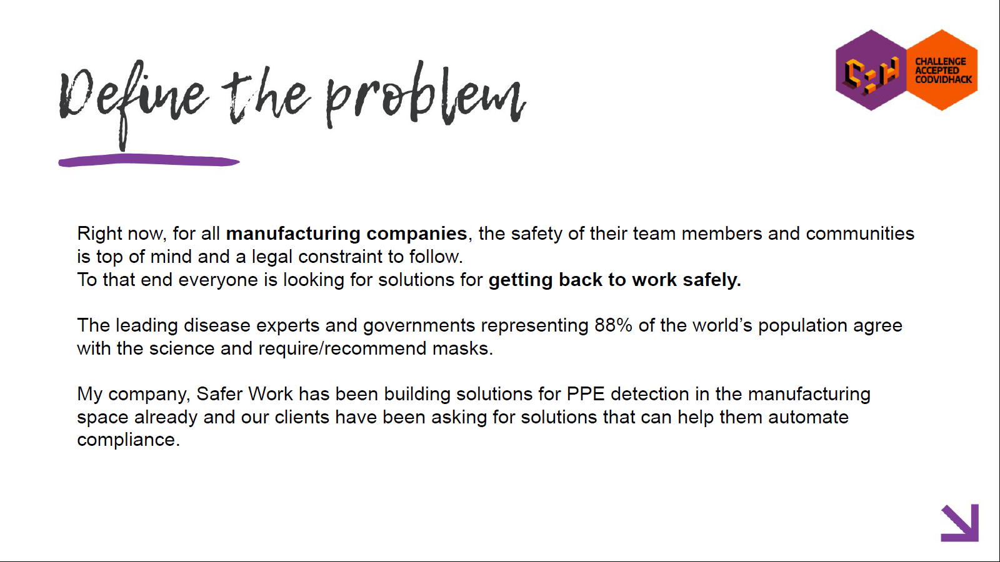
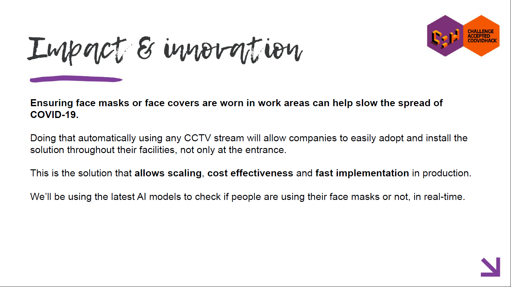
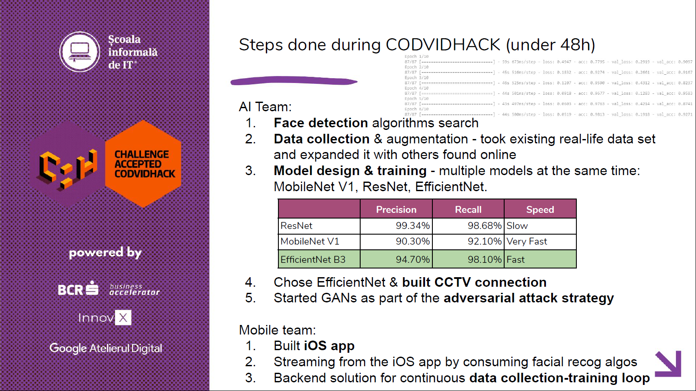

# Visual recognition of people with mask

Simple web server from the winning project of COVID-19 Hackathon.
More info here: https://challenge.scoalainformala.ro/

It was built in Spring Boot and is acting like a bridge between 
the CCTV simulator from iOS app and the AI model for frames processing.

## Tools
* Build Tool: Maven
* Framework: SpringBoot 2.2.7
* IDE: IntelliJ IDEA

## Summary

## Demo links
https://www.youtube.com/watch?v=Uw8cBvar2_E

https://www.youtube.com/watch?v=krWVPFlrdSY